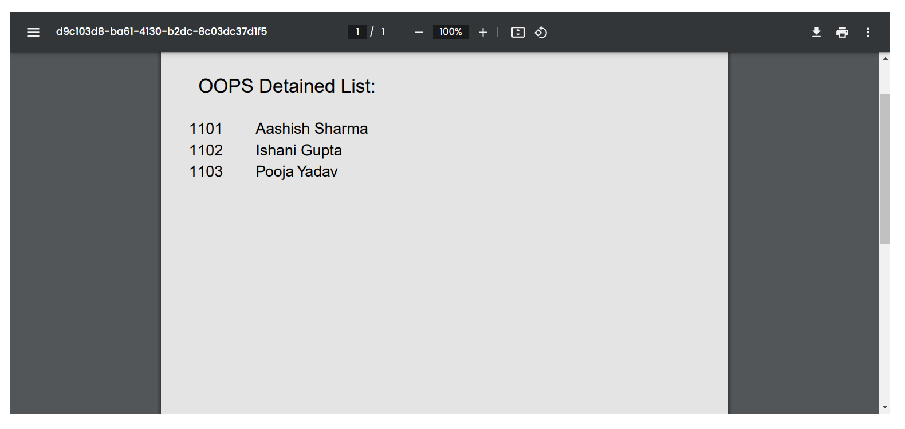

# AttendWell - A Smart Attendance Management System

## How it Works?

#### Step 1: The Administrators will register their institution, create classes, and add subjects & students to the classes.

#### Step 2: Administrators will provide classname & class password to Faculties/teachers.

#### Step 3: Faculty can easily login using class name & password and add & see attendance of all students in class.

#### Step 4: Students can view their attendance by entering their name, class name & Institute name.

## Features

#### 1. Administrators can easily download the list of their students of each class.

#### 2. Faculty Members can easily download the list of detained Students.

